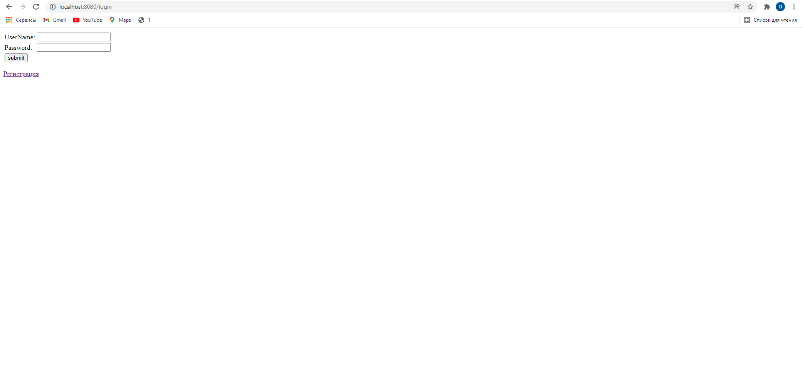
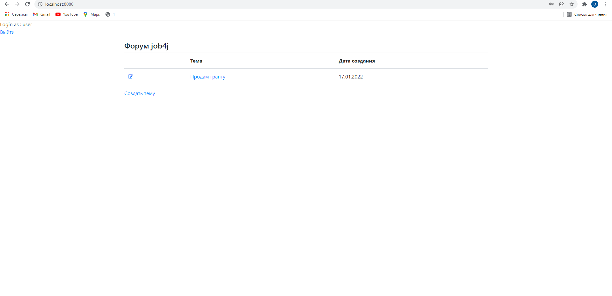
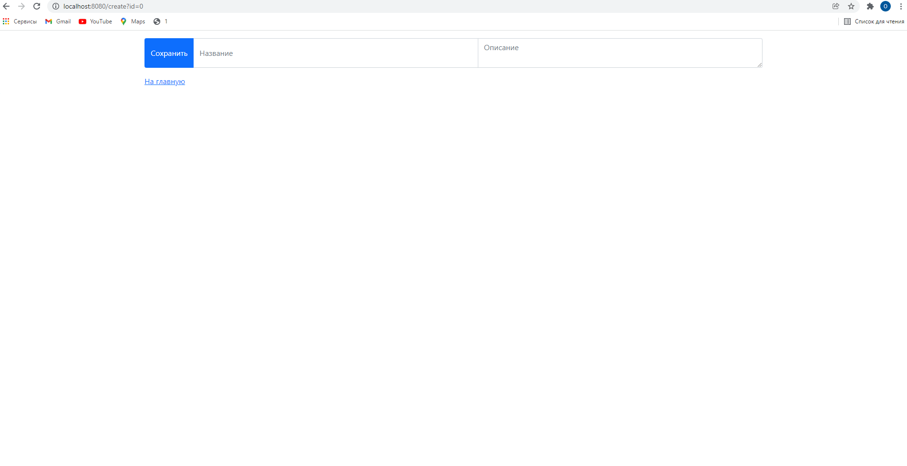

Forum
=============
## Description
This project is the simple forum. Users can add and edit posts.

### Used technologies:
#### Backend
1. Spring Boot(Web, Data, Security)
2. PostgreSQL
3. Liquibase
#### Frontend
1. JSP
2. Bootstrap
### Functionality:
Login page
 
Main page

Edit post

Create post

### Contact
If you have any questions, feel free to contact me: oleg.kolchin.j@gmail.com